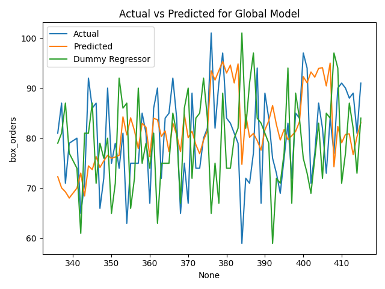
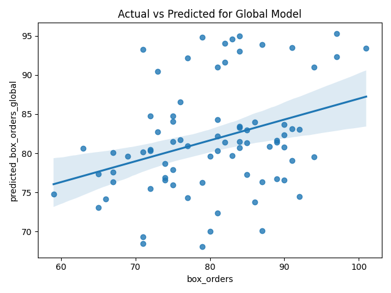
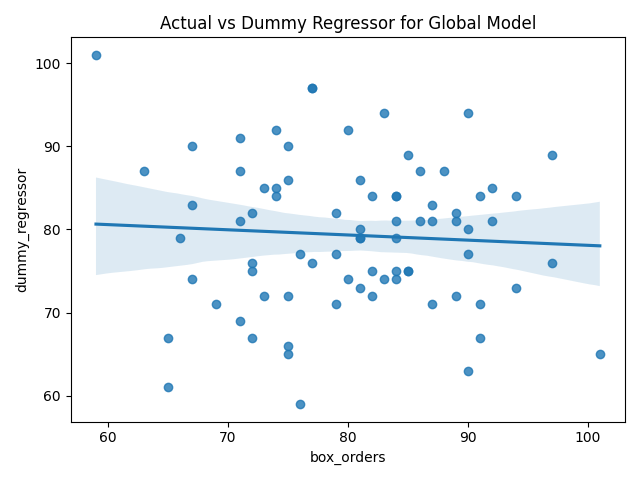
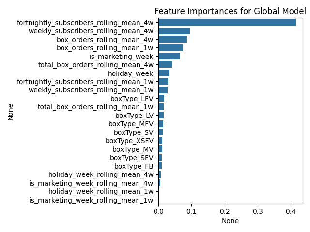
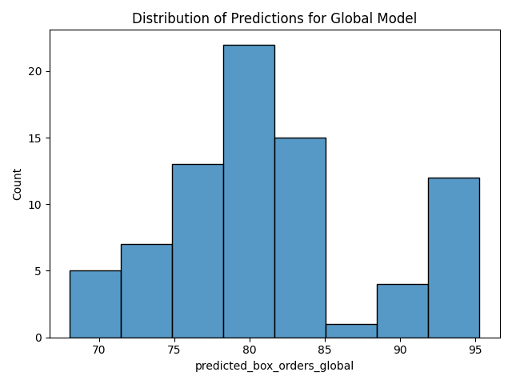
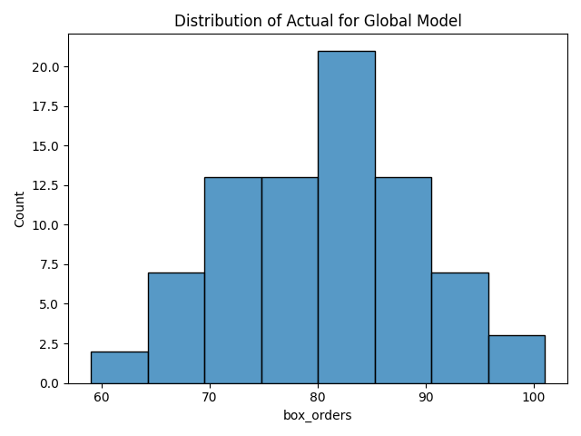

# Box Orders Forecasting Model

This project implements a machine learning model to forecast box orders for different box types. The model uses a Random Forest Regressor to predict future box orders based on historical data and various features.

## Project Structure

```
.
├── data/
│   └── data.csv
├── src/
│   ├── main.py
│   └── lib.py
├── res/
│   └── [generated plots]
└── README.md
```

## Getting Started

### Environment Setup

1. Create a virtual environment (recommended):
```bash
python -m venv venv
source venv/bin/activate  # On Windows: venv\Scripts\activate
```

2. Install required packages:
```bash
pip install -r requirements.txt
```

### Running the Model

To run the forecasting model:
```bash
python src/main.py
```

## Model Details

### Data Preprocessing
- Converts box orders from string to float
- Transforms week column to datetime
- Creates dummy variables for box types
- Calculates rolling means for features
- Handles marketing weeks and holiday weeks

### Model Architecture
The model uses a Random Forest Regressor with the following specifications:
- Number of estimators: 1000
- Maximum depth: 10
- Random state: 42

### Features
The model uses several types of features:
1. Box type indicators (one-hot encoded)
2. Rolling mean features (1-week and 4-week windows)
3. Marketing and holiday indicators
4. Historical order data

### Training Process
- Data is split into training (80%) and testing (20%) sets
- A global model is trained on all box types
- Performance is evaluated using Mean Absolute Error (MAE)

## Model Evaluation

The model's performance is evaluated using:
- Mean Absolute Error (MAE)
- Correlation between actual and predicted values
- Comparison with a dummy regressor (previous week's orders)


## Results

The model generates several visualizations to evaluate its performance:

### Box Orders Over Time


### Model Performance


### Model Performance Correlation



### Feature Importance


### Prediction Distributions



## Dependencies

- pandas
- numpy
- matplotlib
- seaborn
- scikit-learn

