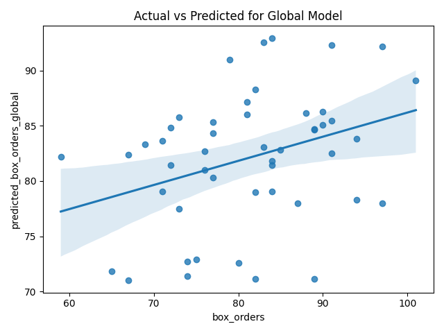
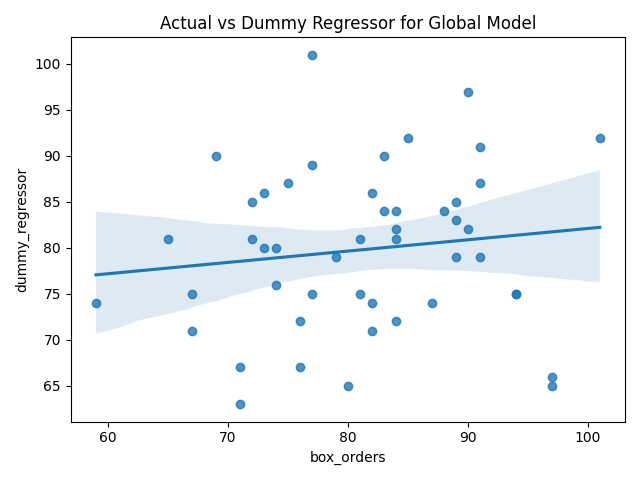
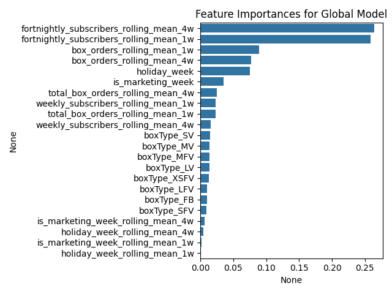

# Box Orders Forecasting Model

This project implements a machine learning model to forecast box orders for different box types. The model uses a Random Forest Regressor to predict future box orders based on historical data and various features, with support for multiple prediction horizons (1-week and 4-week forecasts).

## Project Overview

### Prediction Task
The model aims to forecast the number of orders for different types of produce boxes (e.g., Large Veg, Medium Fruit & Veg, etc.) for both 1-week and 4-week horizons. This forecasting helps in inventory management, supply chain planning, and business operations optimization.

### Data Characteristics
The dataset contains historical order data with the following key components:
- Weekly order volumes for different box types (coded as LV, LFV, MV, MFV, SV, SFV, XSFV, FB)
- Number of subscribers (weekly, fortnightly)
- Temporal information (dates, weeks)
- Business context (marketing weeks, holidays)

#### Data visualization


### Overview of forecasting methods

There are broadly two approaches to forecasting:

1.  **Time Series Modeling**: This approach uses models like Prophet to capture the temporal dynamics of time series data. These models excel in problems with strong seasonal components, such as forecasting flight demand and pricing.

2.  **Machine Learning (ML) Based Approaches**: This involves using algorithms like Random Forest (RF) or XGBoost. Time series characteristics are engineered as features, such as rolling means over different time windows. ML methods are generally better at leveraging diverse features but can be weaker in modeling pure time dynamics. For instance, to predict multiple steps into the future, separate models often need to be trained for each prediction horizon, whereas models like Prophet can be simulated autoregressively.

In this project, we initially experimented with Prophet, but it did not perform well. This is likely due to the significant stochastic component inherent in box order forecasting.

When employing an ML model for problems with multiple categories (like different box types), there are two main strategies:

*   **Separate Models**: Train a distinct model for each category.
*   **Global Model**: Train a single model across all categories, using the category itself as a feature.

A global model can be advantageous when data is scarce for individual categories, as it allows the model to learn from shared patterns across categories, akin to transfer learning.

We tested both approaches, and the global model yielded superior performance for this task.

### Approach
Our approach combines traditional time series analysis with machine learning:
1. Data preprocessing and feature engineering to capture temporal patterns and business context
2. Training separate models for 1-week and 4-week predictions
3. Box-specific analysis to understand individual box type behaviors
4. Comprehensive evaluation using multiple metrics and visualizations

## Project Structure

```
.
├── data/
│   └── data.csv
├── src/
│   ├── main.py      # Main execution script
│   └── lib.py       # Core functionality and utilities
├── res/
│   ├── box_orders_by_type.png
│   ├── box_orders_overall.png
│   ├── total_box_orders_overall.png
│   ├── [1-week horizon results]
│   │   ├── actual_vs_predicted_1w.png
│   │   ├── actual_vs_predicted_1w_*.png
│   │   ├── feature_importances_1w.png
│   │   └── ...
│   └── [4-week horizon results]
│       ├── actual_vs_predicted_4w.png
│       ├── actual_vs_predicted_4w_*.png
│       ├── feature_importances_4w.png
│       └── ...
└── README.md
```

## Getting Started

### Environment Setup

1. Create a virtual environment (recommended):
```bash
python -m venv venv
source venv/bin/activate  # On Windows: venv\Scripts\activate
```

2. Install required packages:
```bash
pip install -r requirements.txt
```

### Running the Model

To run the forecasting model:
```bash
python src/main.py
```

## Model Details

### Data Preprocessing
- Converts box orders from string to float
- Transforms week column to datetime

### Feature Engineering
- Creates dummy variables for categorical features (i.e. box type)
- Generates time-based features:
  - Rolling means (1-week and 4-week windows)
  - Lag features for historical patterns
- Adds business context features:
  - Marketing week indicators
  - Holiday week indicators

### Model Architecture
The model uses a Random Forest Regressor with the following specifications:
- Number of estimators: 1000
- Maximum depth: 10
- Random state: 42

### Features
The model uses several types of features:
1. Box type indicators (one-hot encoded)
2. Rolling mean features (1-week and 4-week windows)
3. Marketing and holiday indicators
4. Historical order data (i.e. previous week's orders)

### Training Process
- Data is split into training (80%) and testing (20%) sets
- A global model is trained on all box types. The box type is used as a feature.
- Performance is evaluated using Mean Absolute Error (MAE)
- Models are trained for both 1-week and 4-week prediction horizons

## Model Evaluation

The model's performance is evaluated using:
- Mean Absolute Error (MAE)
- Correlation between actuals and predicted values
- Comparison with a dummy regressor (previous week's orders)

## Results

The model generates several visualizations to evaluate its performance for both 1-week and 4-week prediction horizons:


### 1-Week Horizon Predictions
#### Actuals vs Predicted vs Dummy Regressor


*This plot compares the actual box orders (ground truth) with the predictions made by the Random Forest model and a simple dummy regressor (which predicts the previous week's orders) for the 1-week forecast horizon. It helps visualize the model's accuracy against a baseline.*

#### Regression Plot: Actual vs. Predicted


*This regression plot visualizes the relationship between the actual values and the values predicted by the ML model for the 1-week horizon. A tighter clustering of points around the diagonal line (indicating perfect prediction) signifies better model performance. When compared to the dummy regressor (which simply predicts the previous week's orders), the ML model's predictions align more closely with the actuals, demonstrating significantly lower error and higher accuracy.*

#### Regression Plot: Actual vs. Dummy Regressor


#### Feature Importances


*This chart displays the relative importance of each feature used by the Random Forest model for the 1-week predictions. It helps understand which factors (e.g., rolling means, specific box types, marketing weeks) have the most influence on the forecast.*

#### Predictions Distribution


*This histogram shows the distribution of the predicted box order values from the ML model for the 1-week horizon. It helps to understand the range and frequency of the model's forecasts.*

#### Actuals Distribution


*This histogram displays the distribution of the actual box order values in the test set for the 1-week horizon. Comparing this to the predictions distribution can reveal if the model captures the general characteristics of the true data distribution.*

### 4-Week Horizon Predictions
#### Actuals vs Predicted vs Dummy Regressor


*Similar to the 1-week horizon, this plot compares actual box orders with predictions from the Random Forest model and the dummy regressor, but for the 4-week forecast horizon. It allows for an assessment of the model's performance over a longer prediction window.*

#### Regression Plot: Actual vs. Predicted


*Similarly, for the 4-week horizon, this regression plot compares the ML model's predictions against the actual values. The ML model again shows a stronger correlation and less scatter compared to what would be observed with the dummy regressor, indicating its superior ability to forecast orders even further into the future. The dummy regressor's performance would typically degrade more sharply over a longer horizon, making the ML model's advantage even more pronounced.*

#### Regression Plot: Actual vs. Dummy Regressor


#### Feature Importances


*This chart shows the feature importances for the Random Forest model trained for the 4-week prediction horizon. It can be compared with the 1-week feature importances to see if the influential factors change with the forecast duration.*

#### Predictions Distribution


*This histogram illustrates the distribution of the predicted box order values from the ML model for the 4-week horizon, providing insight into the model's forecast characteristics at this longer range.*

#### Actuals Distribution


*This histogram shows the distribution of actual box order values in the test set for the 4-week horizon, serving as a reference to evaluate the realism of the model's prediction distribution.*


## Dependencies

- pandas
- numpy
- matplotlib
- seaborn
- scikit-learn

